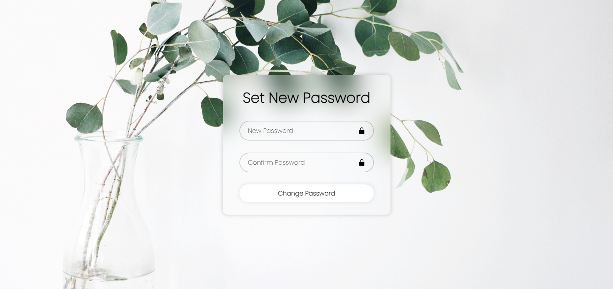

<h1 >Welcome to PlantsBuy</h1>

The welcome page of PlantsBuy is designed to immerse users in the beauty of nature from the moment they arrive. It features stunning images of lush greenery, curated collections of popular plant species, and helpful tips for caring for your botanical companions. Whether you're seeking inspiration for your next plant purchase or simply want to learn more about the fascinating world of plants, our welcome page is your starting point for exploration.

Our Best-Seller Items section showcases the most popular plants among our community of plant lovers. These plants have been carefully curated based on factors such as beauty, ease of care, and overall popularity. Whether you're looking for a trendy succulent, a statement-making monstera, or a classic peace lily, you'll find top-rated options in this section.

Each plant featured in our Best-Seller Items collection comes with detailed descriptions, care instructions, and tips to help you maintain its health and beauty. Whether you're a beginner or an experienced plant parent, you'll find something to love in our curated selection of best-selling plants.

Using see all button you can see different plants and when you click on see more you will get to know more about those plants like temperature, watering, sunlight etc.

Stay ahead of the curve with our Trending Plant Items section, where you'll find the hottest picks and latest botanical trends. Curated by our team of plant experts and informed by the latest gardening fads, this collection features the most sought-after plants of the season.

From rare specimens to must-have varieties making waves on social media, our Trending Plant Items are guaranteed to add a touch of style and sophistication to your plant collection. Explore new and exciting species, discover innovative plant care techniques, and be inspired by the latest trends in indoor gardening.

Dive into the ancient art of bonsai cultivation with our Bonsai Technique section. Bonsai, originating from Japan, is the art of growing miniature trees in containers, and it offers a unique and rewarding way to connect with nature.

We understand the importance of convenience, security, and personalized support when it comes to online plant shopping. That's why we're committed to providing: fast delivery, secure shopping, lifetime support, all India delivery.

At PlantsBuy, we prioritize the security and privacy of our users. That's why we've implemented secure authentication with OTP verification to ensure that your online shopping experience is safe and reliable.

At PlantsBuy, we believe in empowering our users with the tools they need to find the perfect plants for their space. Our advanced search functionality allows you to explore our extensive catalog of plant species with ease, whether you're searching for a specific plant variety or browsing by category.

With our wide variety of plants, you'll find everything from classic favorites like philodendrons and snake plants to rare and exotic specimens that will add a unique touch to your collection. Each plant listing includes detailed information on its care requirements, growth habits, and ideal growing conditions, helping you make informed decisions about which plants will thrive in your home or garden.

Whether you're looking for a low-maintenance houseplant to brighten up your living room or a statement-making specimen to serve as the centerpiece of your botanical display, Plantify has you covered. Explore our diverse selection of plants and discover the perfect green companions for your space!

At PlantsBuy, we've streamlined the online shopping experience to make it as convenient and hassle-free as possible. Our intuitive platform allows you to seamlessly add items to your cart, provide your billing address, enter your card payment details, and successfully place your order with ease.

We understand the importance of security while also ensuring a seamless user experience. That's why we've implemented an easy password setting feature that allows you to create a strong and secure password with minimal hassle.It's even easier to set your password incase of forget password.

We take pride in providing exceptional products and services to our valued customers. Our testimonials section showcases the positive experiences and feedback shared by satisfied customers who have shopped with us.

At PlantsBuy, we strive to keep you informed and engaged throughout your shopping experience. Here are the different types of emails you may receive from us:

### OTP Verification Email:
Upon registering for an account or performing certain sensitive actions, such as updating your account details, you may receive an OTP (One-Time Password) verification email. This email contains a unique code that you'll need to enter to verify your identity and complete the action securely.

### Welcome Email:
When you create an account on Plantify, you'll receive a warm welcome email from us. This email serves as an introduction to our platform and provides helpful information about how to get started, browse our products, and make the most of your shopping experience.

### Forgot Password Email:
If you forget your password and request a password reset, we'll send you a forgot password email with instructions on how to reset your password securely. This email contains a link that you can use to reset your password and regain access to your account.

### Password Set Email:
After successfully setting a new password for your account, you'll receive a confirmation email from us. This email acknowledges that your password has been successfully updated and provides additional tips for keeping your account secure.

### Thank You Email Upon Successful Ordering:
After successfully placing an order on Plantify, you'll receive a thank you email from us. This email confirms that your order has been received and provides details about your order, including the items purchased, order total, and estimated delivery date. We'll also include a special note of appreciation for choosing Plantify for your botanical needs.

Each member of our team brings unique skills, expertise, and perspectives to the table, allowing us to deliver innovative solutions and personalized support to our customers. Whether it's helping you find the perfect plant for your space, answering your questions about plant care, or ensuring that your online shopping experience is smooth and enjoyable, our team is here to assist you every step of the way.
